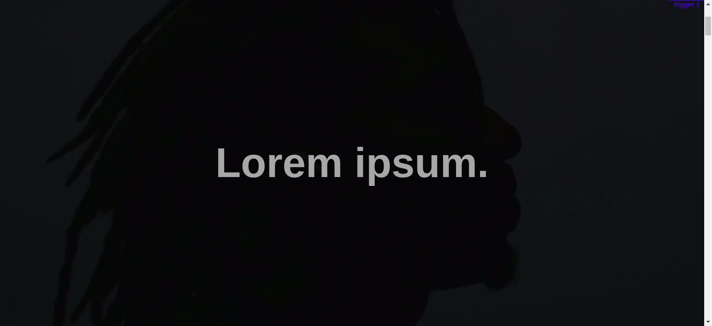

# Apple Animation Scroll

## Installation

Use the package control version [git](https://git-scm.com/downloads).

```bash
git clone https://github.com/Victor1890/airpod-pro-vanilla-js.git
```

```bash
cd airpod-pro-vanilla-js
```

## Library used in the project

1. [Scroll Magic](https://scrollmagic.io/)
2. [Debug.addIndicators](https://scrollmagic.io/docs/debug.addIndicators.html)
3. [Animation Gsap](https://greensock.com/scrollmagic/)
4. [TweenMax](https://greensock.com/tweenmax/)


## Usage

Using VSCode, open the files `index.html` and `app.js`

```html
 <div class="intro">
    <h1>Lorem ipsum.</h1>
    <video src="assets/video/video.mp4"></video>
</div>
```

The file `app.js` is here where configured the animations in the website

```js
/* Video animation scroll */
let scene = new ScrollMagic.Scene({
  duration: 9000,
  triggerElement: intro,
  triggerHook: 0,
})
  .addIndicators()
  .setPin(intro)
  .addTo(controller);
```

```js
/* Text animation scroll */
const textAnim = TweenMax.fromTo(text, 3, { opacity: 1 }, { opacity: 0 });

let scene2 = new ScrollMagic.Scene({
  duration: 1500,
  triggerElement: intro,
  triggerHook: 0,
})
  .setTween(textAnim)
  .addTo(controller);
```
## Screenshot



## License
[MIT](https://choosealicense.com/licenses/mit/)